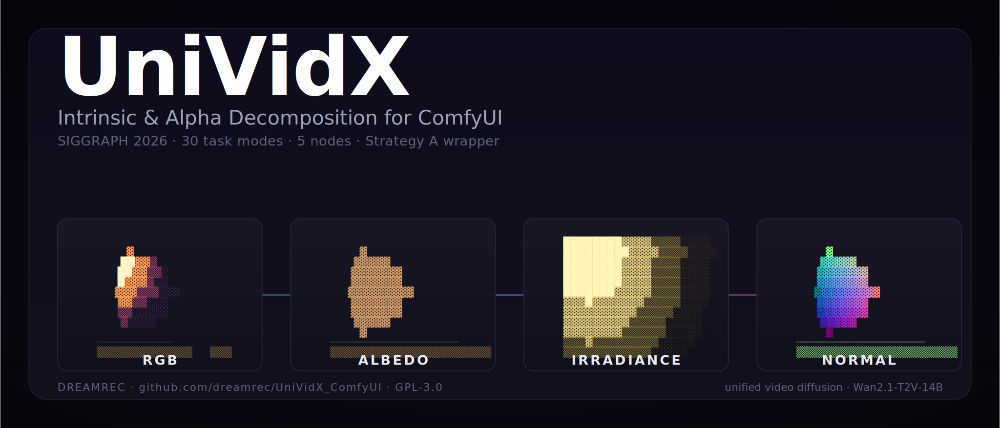
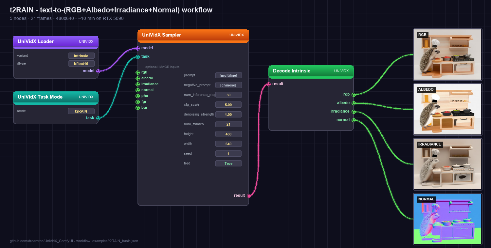
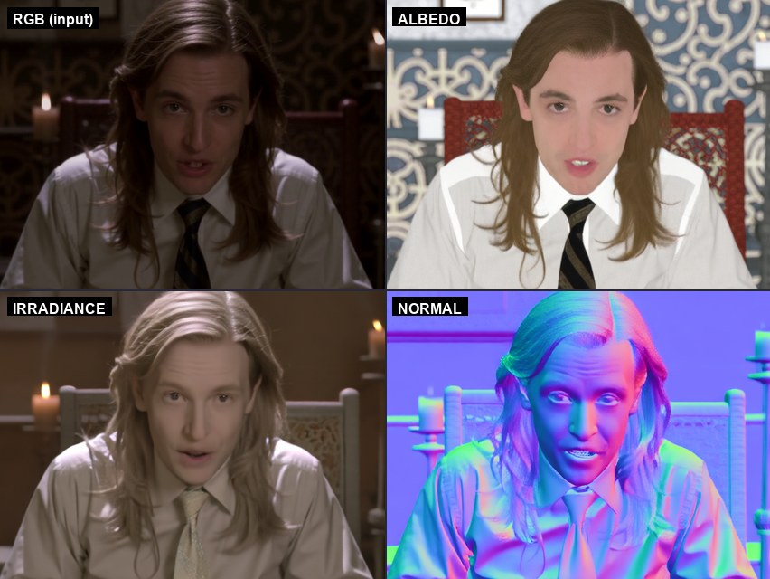
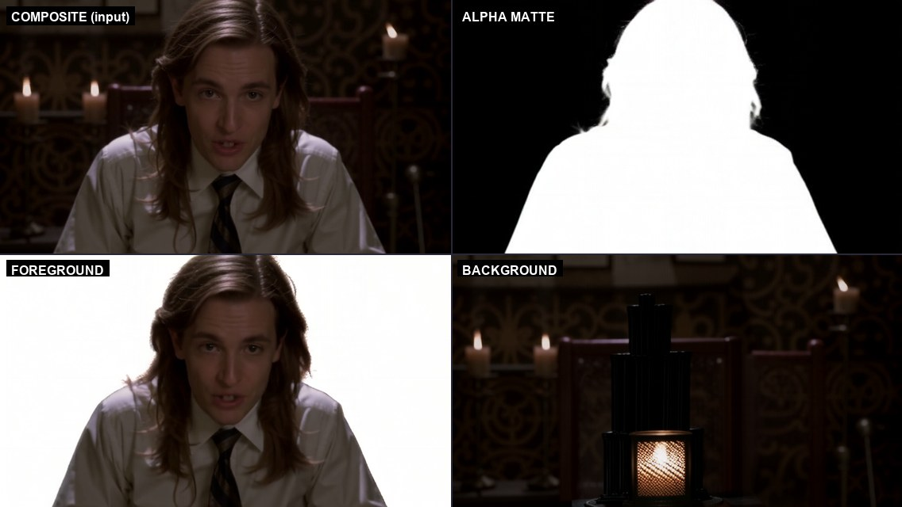
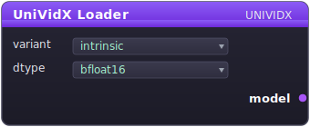
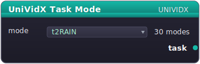
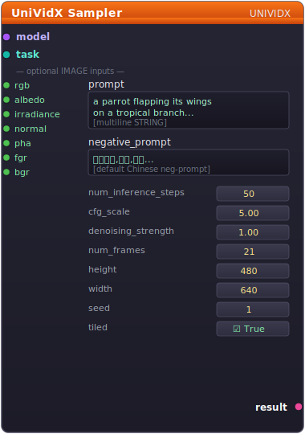
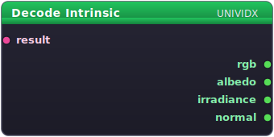
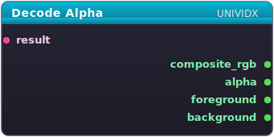

# UniVidX Intrinsic & Alpha Decomposition for ComfyUI

[](https://github.com/dreamrec/UniVidX_ComfyUI/actions/workflows/smoke.yml)


ComfyUI custom nodes for [UniVidX](https://houyuanchen111.github.io/UniVidX.github.io/) (SIGGRAPH 2026): unified video diffusion that decomposes a clip into **RGB / Albedo / Irradiance / Normal** (intrinsic) or **Composite RGB / Alpha matte / Foreground / Background** (alpha). 30 task modes across two model variants, all driven from a single five-node graph.

**What you'd use it for:** relighting (swap the irradiance channel, recombine), VFX alpha pulls without a green screen (a clean matte from any clip), 3D reconstruction pipelines that need normals + albedo as conditioning, ControlNet-style guidance for *other* video models that consume normal maps.

**Strategy A wrapper** — UniVidX's official pipeline runs as an opaque black box. The four output IMAGE batches become standard ComfyUI tensors that flow into any downstream node (VHS video combine, alpha compositing, 3D reconstruction, ControlNet for *other* models, etc.).

### Use this when

- You specifically need **intrinsic** (RGB / Albedo / Irradiance / Normal) or **alpha** (matte / fg / bg) decomposition of a video clip — that's UniVidX's whole reason to exist. No other Wan2.1 wrapper does this.
- You want clean drag-and-drop ComfyUI workflows for the 30 task modes without writing pipeline code.

### Use [`kijai/ComfyUI-WanVideoWrapper`](https://github.com/kijai/ComfyUI-WanVideoWrapper) when

- You want generic Wan2.1/2.2 T2V or I2V (just RGB out, not decomposition).
- You need finer-grained per-block CPU swap, async prefetch, or kijai-curated FP8/GGUF Wan checkpoints. Their wrapper has more model-management surface; ours has the UniVidX-specific decomposition head.

## Visual tour

### Flagship workflow — `t2RAIN`, text → all four intrinsic modalities



### Intrinsic decomposition



A 21-frame portrait clip conditioned on RGB (mode `R2AIN`). UniVidX strips the candlelight from the **albedo**, isolates the soft incoming **irradiance** field, and emits a clean **normal map** of the face. The decoder's RGB slot is a black placeholder (RGB was the input); we paste the conditioning frame back in here for legibility.

### Alpha decomposition



Same source clip, alpha variant + mode `R2PFB`. The **alpha matte** is a true binary-quality mask. **Background** is the most striking output: the model inpaints the wallpaper, chair, and candle stand *behind* where the subject was sitting.

## Quick start

```bash
# 1. Install. The --recurse-submodules flag pulls in the UniVidX vendor
#    repo (~500 MB of upstream Python + small assets — no Git LFS needed).
cd ComfyUI/custom_nodes
git clone --recurse-submodules https://github.com/dreamrec/UniVidX_ComfyUI.git
cd UniVidX_ComfyUI
python -m pip install -r requirements.txt
python install.py        # creates Win junction / POSIX symlink. No admin needed.

# 2. Install the Hugging Face CLI if you don't have it, then download models.
#    ~83 GB total — UniVidX is built on Wan2.1-T2V-14B which is the bulk.
pip install -U "huggingface_hub[cli]"
hf download Wan-AI/Wan2.1-T2V-14B  --local-dir ComfyUI/models/wan21_t2v_14b
hf download houyuanchen/UniVidX    --local-dir ComfyUI/models/unividx

# 3. Restart ComfyUI, drag examples/t2RAIN_basic.json onto the canvas, queue.
```

**ComfyUI Desktop / portable / manual** — paths above assume a layout where `ComfyUI/models/` is a sibling of `ComfyUI/custom_nodes/`. ComfyUI Desktop installs put `models/` under `Documents/ComfyUI/`; the `python install.py` step auto-resolves either layout.

For real video-clip conditioning (your own MP4), use [`examples/R2AIN_video_api.json`](examples/R2AIN_video_api.json) (intrinsic) or [`examples/R2PFB_video_api.json`](examples/R2PFB_video_api.json) (alpha). They load 21 evenly-spaced frames from disk via `VHS_LoadVideoPath`, which means you'll also need [ComfyUI-VideoHelperSuite](https://github.com/Kosinkadink/ComfyUI-VideoHelperSuite) installed.

## Two presets to remember

All numbers measured on RTX 5090 (32 GB), R2AIN @ 480×640×21 frames, video-conditioned LTX portrait clip.

| Preset | Loader settings | Sampler settings | Wall time | Use for |
|---|---|---|---|---|
| **PRODUCTION** | `prefer_sage_attn=True` *(or `compile_dit=True`, pick one)* | `num_inference_steps=20`, `cfg_scale=5.0` | **~14.5 min** ⚠️ | Final renders |
| **PREVIEW** | `prefer_sage_attn=True` | `num_inference_steps=4`, `cfg_scale=1.0` | **~1.4 min** *(13× faster)* | Iterating on RGB-conditioned modes (`R2AIN`, `R2PFB`) — DO NOT use for text-only modes |
| **FP8 PRODUCTION** *(new in 0.4.0)* | `dit_weight_mode=fp8_prequantized` | `num_inference_steps=20`, `cfg_scale=5.0` | **9.43 min** *(measured)* | Final renders on memory-constrained cards (~14 GB DiT VRAM) — strictly better than PRODUCTION on this hardware |

⚠️ The PRODUCTION row's "~14.5 min" was measured pre-0.3.0 and is being re-benched as part of the 0.4.0 close-out — Tier-B's no-sage BF16 baseline measured 10.85 min on the same workflow, which is inconsistent with `prefer_sage_attn=True` shaving "–18%" wall. See [`ROADMAP.md`](ROADMAP.md) → "Close 0.4.0 final."

The PREVIEW preset gives marginally softer detail (tie stripe, facial geometry) but all decompositions remain physically correct on this content. Validate per content type if you have high-motion clips.

## Using FP8 (new in 0.4.0)

On a 32 GB card the simplest performance + memory win is:

```
UniVidXLoader
  variant            = intrinsic   (or alpha)
  dtype              = bfloat16
  dit_weight_mode    = fp8_prequantized   ← the new knob
  vram_buffer_gb     = 4.0
  prefer_sage_attn   = False
  compile_dit        = False
```

That gives ~14 GB DiT residency (vs ~28 GB BF16) and ~9.4 min wall on the R2AIN_video_api.json workflow at production scale. Quality: PSNR vs BF16 measured at 30.89 dB (albedo), 39.17 dB (irradiance), 36.28 dB (normal), exact match on RGB-conditioned slots. See CHANGELOG `0.4.0-rc1` for the full benchmark.

How it works: after UniVidX's standard BF16 cold-load, the loader walks the DiT, computes per-tensor absmax scales for each Linear layer, casts the weight tensors to `torch.float8_e4m3fn`, and replaces each Linear with an `FP8Linear` that dequantizes on forward. UniVidX's per-modality LoRA adapters (the four `lora_A/B_<mod>` pairs at each attention block) are preserved at BF16 by walking through PEFT wrappers and replacing only the inner base layer. No external file needed — when a Kijai `Wan2_1-T2V-14B_fp8_e4m3fn_scaled.safetensors` lands upstream and is dropped into `models/diffusion_models/`, the loader will use it directly instead of runtime-quantizing.

Stacking compatibility with `prefer_sage_attn` / `compile_dit` is being validated as part of 0.4.0 close-out.

## Optimization knobs (Loader)

Wired and validated on Blackwell (RTX 5090) + Windows + Python 3.12 + Torch 2.7.0+cu128:

| Knob | Effect | Measured Δ vs baseline | Notes |
|---|---|---|---|
| `prefer_sage_attn=True` | Patches DiffSynth + UniVidX `flash_attention()` to cascade `sage → FA2 → SDPA`. Defensively un-pollutes `F.scaled_dot_product_attention` (see Stable3DGen note below). | **–18% wall, –21% per-step** | Quality verified visually identical to FA2 baseline |
| `compile_dit=True` | `torch.compile(dit, mode='reduce-overhead', dynamic=True)` | **–17% wall, –28% per-step** | First sampler step pays ~90 s graph capture |
| `dtype=fp8_e4m3fn` / `fp8_e5m2` | Post-quantize DiT via `mmgp.offload.quantize` | **DEPRECATED — hangs in our test, removed in 0.5.0** | Use `dit_weight_mode=fp8_prequantized` instead |
| `dit_weight_mode=fp8_prequantized` | Runtime-quantize the DiT's ~400 Linears to FP8 e4m3fn with per-tensor absmax scaling after BF16 cold-load. PEFT-aware (LoRA stays BF16) | **–13% wall, ~50% DiT VRAM** (9.43 min vs 10.85 min BF16; ~14 GB vs ~28 GB on R2AIN 480×640×21×20) | Ships in 0.4.0. PSNR vs BF16 at production scale: albedo 30.89 dB, irradiance 39.17 dB, normal 36.28 dB, RGB exact. Speedup comes from fully-resident FP8 DiT avoiding `enable_vram_management`'s layer streaming. |
| `vram_buffer_gb` | GB kept free for activations; passed to `model.pipe.enable_vram_management()` on UniVidX's WanVideoPipeline (text encoder + DiT + VAE layer streaming) | **+65% wall going 4.0 → 12.0** (10.36 → 17.10 min on R2AIN baseline 480×640×21×20, no sage/compile) | The biggest perf knob in the system — was mislabelled "deprecated, no-op" in 0.1.0–0.2.1 due to a misdiagnosis (see CHANGELOG). Lower = more layer residency = faster; raise only if you hit OOM. 4.0 GB default is near-optimal on 32 GB cards. Effectively a no-op when `dit_weight_mode=fp8_prequantized` because the FP8 DiT fits fully resident. |

**Important: the two working knobs do NOT stack.** Both target the same per-step DiT bottleneck — combining them ran 14.99 min, *worse* than either alone. Pick one.

### SageAttention install (for `prefer_sage_attn=True`)

PyPI ships only sage 1.0.6 (head_dim restricted to {64,96,128}, Hopper/Ada-tuned only). For Blackwell + Windows + cp312 + Torch 2.7, use the prebuilt wheel from [woct0rdho/SageAttention](https://github.com/woct0rdho/SageAttention/releases):

```bash
pip install "https://github.com/woct0rdho/SageAttention/releases/download/v2.2.0-windows/sageattention-2.2.0+cu128torch2.7.1-cp312-cp312-win_amd64.whl"
```

Match the wheel to your stack: `cu128`/`cu130` (CUDA), `torch2.7.1`/`2.8.0` (PyTorch), `cp310`/`cp311`/`cp312`/`cp313` (Python).

> **Cross-plugin gotcha — Stable3DGen SDPA pollution.** ComfyUI-3D-Pack's `Stable3DGen/trellis/backend_config.py` does `F.scaled_dot_product_attention = sageattn` *globally* at module import when sageattention is importable. That hostile swap breaks any other custom node using SDPA with head_dim outside sage's set (UniVidX's VAE has 1-head SDPA where head_dim = channel_count, hits 384). Our `runtime.load_model()` defensively restores `F.scaled_dot_product_attention` from `torch._C._nn.scaled_dot_product_attention` (the C++ impl, immune to Python alias rebinding). If other custom nodes broke after you installed sage, this is why.

### What does NOT help on Blackwell

- **Flash Attention 3** — Hopper-only (H100/H800). Doesn't apply to RTX 5090.
- **Flash Attention 4** — Linux-only on PyPI; module name (`flash_attn.cute`) doesn't match DiffSynth's auto-detect.

### FP8 status

We wired `dtype=fp8_e4m3fn` / `fp8_e5m2` via `mmgp.offload.quantize(model.pipe.dit, weights="qfloat8", exclude=["*lora_*"])`. **The quantize() pass hung in our cold-load test** (no completion after 22 min, required killing ComfyUI). Likely cause: quanto walks all ~720 Linear layers in Wan2.1-14B + UniVidX's PEFT-attached LoRA pairs, computing per-tensor scales over the 28 GB BF16 DiT through mmgp's read-only mmap — possibly genuinely slow, possibly genuinely deadlocked.

The widget is shipped but **flagged EXPERIMENTAL in tooltip + this README**. Use at your own risk on this stack today. See [Roadmap](#roadmap) for the planned proper fix.

## Node overview

Five nodes, all under the `UniVidX` category. Custom socket types — `UNIVIDX_MODEL` (purple), `UNIVIDX_TASK` (teal), `UNIVIDX_RESULT` (pink) — keep the graph type-safe; standard `IMAGE` (green) is used everywhere a frame batch flows.

<table>
<tr><td width="380">



</td><td>

**`UniVidXLoader`** — Loads `intrinsic` or `alpha` variant, exposes the perf knobs (`compile_dit`, `prefer_sage_attn`, `dtype`, `vram_buffer_gb`, `dit_weight_mode`). Models are cached per `(variant, ckpt, device, dtype, vram_buffer, fp8_qtype, compile_dit, prefer_sage_attn, dit_weight_mode)` so toggling any of them triggers a clean re-load. `vram_buffer_gb` is in the key as of 0.3.0 because it now actually controls VRAM management (was a no-op in 0.1.0–0.2.1). `dit_weight_mode` is in the key as of 0.4.0 — picking `fp8_prequantized` drops DiT steady-state VRAM ~50% (with -13% wall as a bonus); see the perf table below.

</td></tr>
<tr><td>



</td><td>

**`UniVidXTaskMode`** — Picks one of 30 modes from a dropdown. Outputs `UNIVIDX_TASK` carrying the mode + family. The sampler validates the family against the loaded model variant.

</td></tr>
<tr><td>



</td><td>

**`UniVidXSampler`** — Runs UniVidX's `pipe()` end-to-end inside a `chdir(vendor/UniVidX)` context. Accepts the model + task + a text prompt + up to 7 optional `IMAGE` inputs (one per modality across both families). Inputs not required by the active mode are silently ignored.

</td></tr>
<tr><td>



</td><td>

**`UniVidXDecodeIntrinsic`** — Splays an intrinsic-family `UNIVIDX_RESULT` into 4 `IMAGE` batches: `rgb / albedo / irradiance / normal`. Modalities that were *conditions* come back as a black placeholder of the right shape, so downstream graphs never break on missing slots.

</td></tr>
<tr><td>



</td><td>

**`UniVidXDecodeAlpha`** — Same shape as above but for the alpha family: `composite_rgb / alpha / foreground / background`. Raises `ValueError` if you try to feed it an intrinsic-family result (and vice versa).

</td></tr>
</table>

## Models

| Pack | Where | Size |
|---|---|---|
| [Wan-AI/Wan2.1-T2V-14B](https://huggingface.co/Wan-AI/Wan2.1-T2V-14B) | `ComfyUI/models/wan21_t2v_14b/` | ~69 GB |
| [houyuanchen/UniVidX](https://huggingface.co/houyuanchen/UniVidX) | `ComfyUI/models/unividx/` | ~1.6 GB |

`install.py` verifies the vendored UniVidX submodule is at the pinned commit, copies bundled demo workflows into ComfyUI's user workflow directory, and prints a hint about the model files you still need to download. The actual **path bridging** — Windows directory junction (or POSIX symlink) from `vendor/UniVidX/models/` to `ComfyUI/models/wan21_t2v_14b/`, plus hardlinks for the two LoRA adapters — happens **at runtime** on first model load via `src/path_resolver.ensure_symlinks()` (called from `runtime.initialize()`). This lazy approach lets the install step stay quick and avoids touching the filesystem if the user never queues a UniVidX workflow.

## Mode reference

Mode names encode `<conditions>2<targets>`. `t` on the left = "text-only".

**Intrinsic** (variant `intrinsic`): R=RGB, A=Albedo, I=Irradiance, N=Normal — 15 modes total: `t2RAIN`, `R2AIN`, `A2RIN`, `I2RAN`, `N2RAI`, `RA2IN`, `RI2AN`, `RN2AI`, `AI2RN`, `AN2RI`, `IN2RA`, `RAI2N`, `RAN2I`, `RIN2A`, `AIN2R`.

**Alpha** (variant `alpha`): R=Composite RGB, P=Pha (matte), F=Fgr, B=Bgr — 15 modes total: `t2RPFB`, `R2PFB`, `P2RFB`, `F2RPB`, `B2RPF`, `RP2FB`, `RF2PB`, `RB2PF`, `PF2RB`, `PB2RF`, `FB2RP`, `RPF2B`, `RPB2F`, `RFB2P`, `PFB2R`.

For modes where a modality is a *condition*, the corresponding decoder output is a black tensor of the right shape — downstream nodes still get a valid `IMAGE`.

## Roadmap

Full v0.3 execution plan in [`ROADMAP_v0.3.md`](ROADMAP_v0.3.md). Summary of priority order (corrected after second-pass review):

1. ~~**`vram_buffer_gb` correctness fix**~~ — **shipped in 0.3.0.** Cache key now includes `vram_buffer` so distinct values get distinct cache entries (was the actual bug). The wiring itself (`model.pipe.enable_vram_management(...)`) was already correct in 0.2.1 — the roadmap's "wrong method target" diagnosis was disproven by a live runtime probe; see CHANGELOG 0.3.0 "Diagnosis correction." Wrapped in `if/else` with explicit INFO-on-success + WARNING-on-missing logging so a future regression can't recur silently. Tier-A5 bench measured **+65% wall going `vram_buffer` 4.0 → 12.0** — this is the biggest single perf lever in the system, not the "deprecated" knob it was labelled.
2. **FP8 via pre-quantized Kijai weights** (replaces the hung runtime-quantize path). The current `dtype=fp8_*` knob calls `mmgp.offload.quantize()` AFTER constructing a full BF16 DiT — which both hangs and destroys the main benefit (the BF16 cold load). Right design is a deeper refactor:
  1. **Split the public knob** into `compute_dtype = {bf16, fp16}` and `dit_weight_mode = {bf16_shards, fp8_prequantized, fp8_runtime_experimental}` so users get clear choices and runtime quantization is hidden behind an explicit experimental flag.
  2. **Add path resolution** for pre-quantized weights at `ComfyUI/models/diffusion_models/Wan2_1-T2V-14B_fp8_e4m3fn.safetensors` (Kijai/ComfyUI convention).
  3. **Implement an alternate DiT loader** that bypasses upstream's hardcoded six-shard BF16 loop in [`vendor/UniVidX/src/pipelines/univid_intrinsic.py:447`](vendor/UniVidX/src/pipelines/univid_intrinsic.py) and `univid_alpha.py:425`. Instantiate `WanModel`, normalize key prefixes, stream-load FP8 safetensors, keep norms/bias/time/text/patch/head in BF16/FP32, and preserve scale tensors when present.
  4. **Keep UniVidX LoRA adapters in BF16.** PEFT's dynamic `adapter_names=[...]` switching is central to UniVidX's per-modality routing — a generic FP8 `nn.Linear` substitution would break it.
  5. **Phase 1 ("memory-safe FP8"):** FP8 base weights + BF16 LoRA + dequantize-or-scaled-linear base path. Correctness first.
  6. **Phase 2 ("fast FP8"):** adapter-aware `_scaled_mm` for the base projection plus BF16 LoRA residuals. Needs a custom adapter-aware Linear or a real PEFT integration — not just Kijai's no-LoRA fast path.
  7. **Validate** with the tiny R2AIN/R2PFB workflows first, then benchmark BF16 vs FP8 on cold-load time, peak VRAM, per-step time, and output sanity (per-modality SSIM/PSNR vs the BF16 reference).
- **Step-distill LoRA stacking** — try [LightX2V's `Wan21_T2V_14B_lightx2v_cfg_step_distill_lora_rank32.safetensors`](https://huggingface.co/lightx2v/Wan2.1-T2V-14B-StepDistill-CfgDistill-Lightx2v) on top of UniVidX's per-modality LoRA. Could close the small quality gap of the PREVIEW 4-step preset. Needs PEFT compatibility verification with UniVidX's `add_multiple_loras_to_model` machinery.

## Requirements

- ComfyUI 0.20+ on Python 3.10+ (tested on 3.12.9)
- PyTorch ≥ 2.7 with CUDA 12.8 (Blackwell needs cu128 — older torch errors with `no kernel image is available for execution on the device.`)
- ≥24 GB VRAM (32 GB recommended for headroom)
- ~83 GB free disk for the model packs
- 16+ GB host RAM
- DiffSynth-Studio + mmgp + transformers ≥ 4.38 (auto-installed via `requirements.txt`)

## Windows-specific patches

Three patches applied automatically on Windows; no-op on POSIX. Fully documented inline in `src/runtime.py` and `src/path_resolver.py`:

1. **JSON path escaping** — `json.dumps([t5, vae])` so Windows backslashes don't break UniVidX's `json.loads`.
2. **Read-only mmap for safetensors** — patch `mmgp.safetensors2.torch_load_file` to use `writable_tensors=False` (avoids `[WinError 1455] paging file too small` on six 9.84 GB DiT shards).
3. **Junctions + hardlinks instead of symlinks** — `mklink /J` + `os.link()` (no Admin / Developer Mode required).

## Troubleshooting

- **`MissingModelFile`** — re-run the `hf download` commands.
- **`R2AIN` rgb output is black** — correct, RGB was the input; decoder emits a black placeholder of the right shape.
- **Text-only alpha matte (`t2RPFB`) is white** — known model limit, not a bug. Use `R2PFB_video_api.json` instead.
- **Per-step time > 1 min on 32 GB+ GPU** — VRAM management didn't activate. Verify GPU temp <60°C with 99% util = memory-bound.
- **`CUDA error: no kernel image is available`** — torch too old for Blackwell; upgrade to `torch>=2.7+cu128`.
- **Custom nodes broke after installing sageattention** — see the Stable3DGen pollution note above. Our defensive un-pollute fixes UniVidX; other affected nodes need the same fix or `pip uninstall sageattention`.

For workflow-specific gotchas see [`examples/README.md`](examples/README.md) and [`examples/test_matrix/README.md`](examples/test_matrix/README.md).

## Out of scope (Strategy A boundary)

These would require porting UniVidX's Cross-Modal Self-Attention onto a different DiT class (multi-week project):

- Stacking community Wan2.1/2.2 LoRAs on UniVidX's DiT
- Injecting ControlNet / IP-Adapter inside UniVidX's denoising loop
- Replacing UniVidX's sampler with a ComfyUI KSampler
- Native `MODEL`-type integration (interop with kijai's WanVideoWrapper)

Strategy A's value is at the **I/O boundary** — composing UniVidX outputs with arbitrary downstream ComfyUI nodes. Validated end-to-end in `examples/test_matrix/` (10/10 passing).

## Credits

- [UniVidX](https://github.com/houyuanchen111/UniVidX) — vendored at a pinned commit
- [Wan-AI / Wan2.1-T2V-14B](https://huggingface.co/Wan-AI/Wan2.1-T2V-14B) — base text-to-video DiT
- [DiffSynth-Studio](https://github.com/modelscope/DiffSynth-Studio) — pipeline runtime
- [mmgp](https://pypi.org/project/mmgp/) — paged memory loading
- [woct0rdho/SageAttention](https://github.com/woct0rdho/SageAttention) — Blackwell sage 2.x wheels
- [ComfyUI](https://github.com/comfyanonymous/ComfyUI) — host runtime

## License

[GPL-3.0](LICENSE). Vendored upstream deps keep their own licenses (UniVidX, Wan-AI/Wan2.1-T2V-14B).
